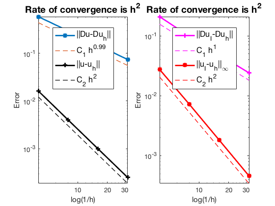
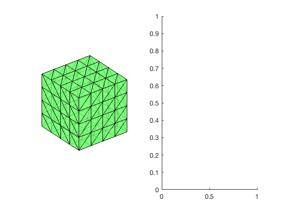
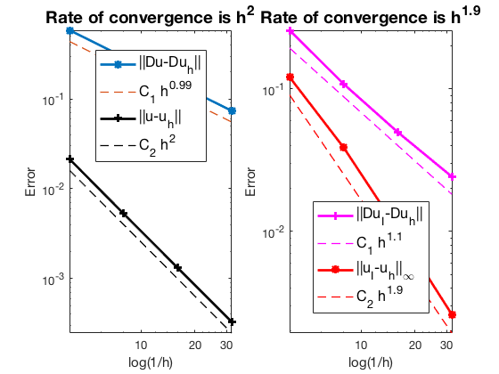
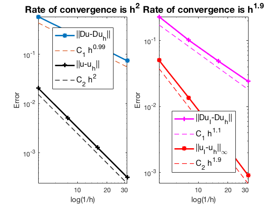

This example is to show the rate of convergence of the linear finite element approximation of the Poisson equation on the unit cube:

$$- \Delta u = f \; \hbox{in } (0,1)^3$$

for the following boundary conditions
- Non-empty Dirichlet boundary condition: $u=g_D \hbox{ on }\Gamma_D, \nabla u\cdot n=g_N \hbox{ on }\Gamma_N.$
- Pure Neumann boundary condition: $\nabla u\cdot n=g_N \hbox{ on } \partial \Omega$.
- Robin boundary condition: $g_R u + \nabla u\cdot n=g_N \hbox{ on }\partial \Omega$.

**References**:
- [Quick Introduction to Finite Element Methods]({{ site.baseurl }})
- [Introduction to Finite Element Methods](http://www.math.uci.edu/~chenlong/226/Ch2FEM.pdf)
- [Progamming of Finite Element Methods](http://www.math.uci.edu/~chenlong/226/Ch3FEMCode.pdf)

**Subroutines**:

    - Poisson3WG
    - cubePoisson3WG
    - femPoisson3
    - Poisson3WGfemrate
    
The method is implemented in `Poisson3` subroutine and tested in `cubePoisson`. Together with other elements (P1, P2,Q1,WG), `femPoisson3` provides a concise interface to solve Poisson equation. The P1 element is tested in `Poisson3femrate`. This doc is based on `Poisson3femrate`.    

## The Lowest Order Weak Galerkin Element

The basis and the local matrices can be found in [Progamming of Weak Galerkin Methods](http://www.math.uci.edu/~chenlong/ifemdoc/fem/WGprogramming.pdf)

## Mixed boundary condition


```matlab
%% Setting
[node,elem] = cubemesh([0,1,0,1,0,1],0.5); 
mesh = struct('node',node,'elem',elem);
option.L0 = 1;
option.maxIt = 4;
option.elemType = 'WG';
option.printlevel = 1;
option.plotflag = 1;
```


```matlab
%% Non-empty Dirichlet boundary condition.
pde = sincosdata3;
mesh.bdFlag = setboundary3(node,elem,'Dirichlet','~(x==0)','Neumann','x==0');
femPoisson3(mesh,pde,option);
```

    Multigrid V-cycle Preconditioner with Conjugate Gradient Method
    #dof:     6528,  #nnz:    25576, smoothing: (1,1), iter: 17,   err = 7.80e-09,   time = 0.14 s
    Multigrid V-cycle Preconditioner with Conjugate Gradient Method
    #dof:    50688,  #nnz:   223244, smoothing: (1,1), iter: 17,   err = 9.10e-09,   time = 0.28 s
    Multigrid V-cycle Preconditioner with Conjugate Gradient Method
    #dof:   399360,  #nnz:  1815764, smoothing: (1,1), iter: 17,   err = 9.78e-09,   time =  2.6 s
    Table: Error
     #Dof        h        ||u-u_h||    ||Du-Du_h||   ||DuI-Du_h|| ||uI-u_h||_{max}
    
       864   2.500e-01   1.62586e-02   5.82293e-01   2.08771e-01   2.74409e-02
      6528   1.250e-01   4.03120e-03   2.94275e-01   9.83063e-02   7.18140e-03
     50688   6.250e-02   1.00634e-03   1.47521e-01   4.83526e-02   1.81988e-03
    399360   3.125e-02   2.51527e-04   7.38079e-02   2.40757e-02   4.58839e-04
    
    Table: CPU time
     #Dof    Assemble     Solve      Error      Mesh    
    
       864   1.70e-01   9.68e-03   9.00e-02   1.00e-02
      6528   1.10e-01   1.39e-01   4.00e-02   2.00e-02
     50688   4.10e-01   2.82e-01   2.00e-01   9.00e-02
    399360   4.14e+00   2.59e+00   1.77e+00   0.00e+00
    


    

    


    

    


## Pure Neumann boundary condition

When pure Neumann boundary condition is posed, i.e., $-\Delta u =f$ in $\Omega$ and $\nabla u\cdot n=g_N$ on $\partial \Omega$, the data should be consisitent in the sense that $\int_{\Omega} f \, dx + \int_{\partial \Omega} g \, ds = 0$. The solution is unique up to a constant. A post-process is applied such that the constraint $\int_{\Omega}u_h dx = 0$ is imposed. 


```matlab
%% Pure Neumann boundary condition.
option.plotflag = 0;
mesh.bdFlag = setboundary3(node,elem,'Neumann');
femPoisson3(mesh,pde,option);
```

    Multigrid V-cycle Preconditioner with Conjugate Gradient Method
    #dof:     6528,  #nnz:    27909, smoothing: (1,1), iter: 20,   err = 7.29e-09,   time =  0.1 s
    Multigrid V-cycle Preconditioner with Conjugate Gradient Method
    #dof:    50688,  #nnz:   232473, smoothing: (1,1), iter: 21,   err = 4.09e-09,   time = 0.33 s
    Multigrid V-cycle Preconditioner with Conjugate Gradient Method
    #dof:   399360,  #nnz:  1858773, smoothing: (1,1), iter: 22,   err = 4.23e-09,   time =  3.2 s
    Table: Error
     #Dof        h        ||u-u_h||    ||Du-Du_h||   ||DuI-Du_h|| ||uI-u_h||_{max}
    
       864   2.500e-01   2.14311e-02   5.83747e-01   2.58148e-01   1.21000e-01
      6528   1.250e-01   5.28526e-03   2.94315e-01   1.08333e-01   3.88004e-02
     50688   6.250e-02   1.31642e-03   1.47495e-01   4.97809e-02   1.03134e-02
    399360   3.125e-02   3.28925e-04   7.38022e-02   2.42593e-02   2.61798e-03
    
    Table: CPU time
     #Dof    Assemble     Solve      Error      Mesh    
    
       864   6.00e-02   2.09e-03   2.00e-02   0.00e+00
      6528   3.00e-02   1.01e-01   3.00e-02   1.00e-02
     50688   3.90e-01   3.27e-01   1.60e-01   8.00e-02
    399360   4.20e+00   3.25e+00   1.62e+00   0.00e+00
    


    

    


## Robin boundary condition


```matlab
%% Pure Robin boundary condition.
pde = sincosRobindata3;
mesh.bdFlag = setboundary3(node,elem,'Robin');
femPoisson3(mesh,pde,option);
```

    Multigrid V-cycle Preconditioner with Conjugate Gradient Method
    #dof:     6528,  #nnz:    27912, smoothing: (1,1), iter: 17,   err = 3.75e-09,   time = 0.085 s
    Multigrid V-cycle Preconditioner with Conjugate Gradient Method
    #dof:    50688,  #nnz:   232476, smoothing: (1,1), iter: 17,   err = 7.36e-09,   time = 0.26 s
    Multigrid V-cycle Preconditioner with Conjugate Gradient Method
    #dof:   399360,  #nnz:  1858776, smoothing: (1,1), iter: 17,   err = 7.33e-09,   time =  2.1 s
    Table: Error
     #Dof        h        ||u-u_h||    ||Du-Du_h||   ||DuI-Du_h|| ||uI-u_h||_{max}
    
       864   2.500e-01   2.06220e-02   5.78283e-01   2.29477e-01   5.01643e-02
      6528   1.250e-01   5.16104e-03   2.93750e-01   1.01338e-01   1.36257e-02
     50688   6.250e-02   1.29034e-03   1.47454e-01   4.87501e-02   3.60385e-03
    399360   3.125e-02   3.22587e-04   7.37995e-02   2.41260e-02   9.11692e-04
    
    Table: CPU time
     #Dof    Assemble     Solve      Error      Mesh    
    
       864   4.00e-02   1.77e-03   1.00e-02   0.00e+00
      6528   6.00e-02   8.46e-02   3.00e-02   1.00e-02
     50688   3.00e-01   2.61e-01   1.80e-01   1.20e-01
    399360   3.01e+00   2.15e+00   1.72e+00   0.00e+00
    


    

    


## Conclusion

The optimal rate of convergence of the H1-norm (1st order) and L2-norm
(2nd order) is observed. No superconvergence for $\|\nabla u_I - \nabla u_h\|$.

MGCG converges uniformly in all cases.
